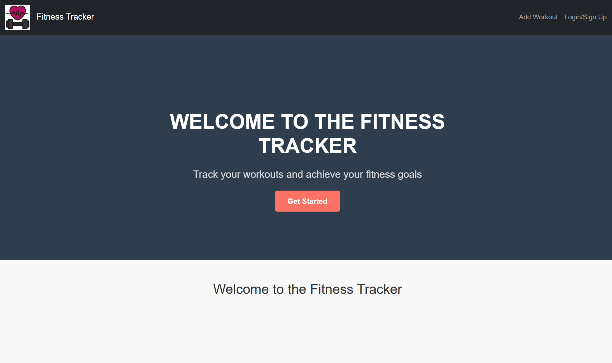
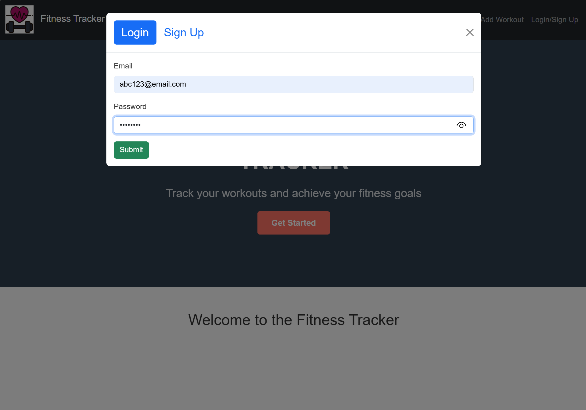
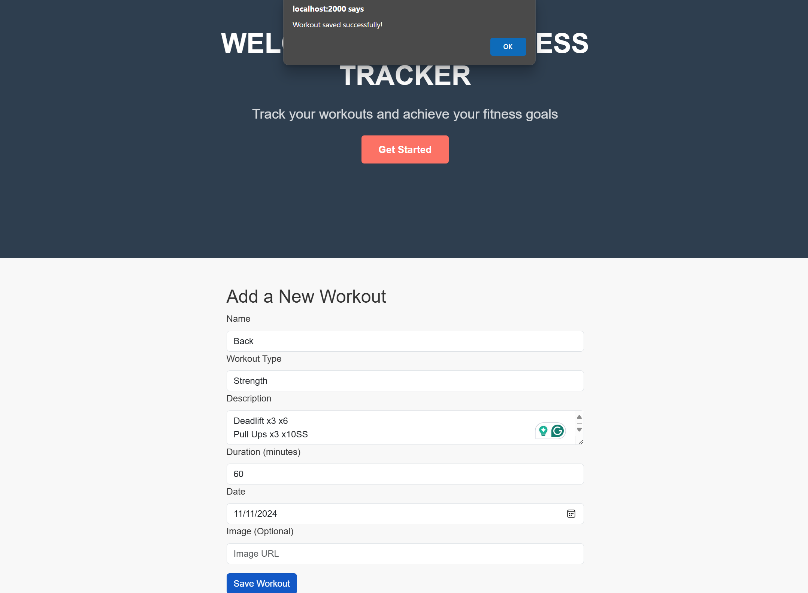
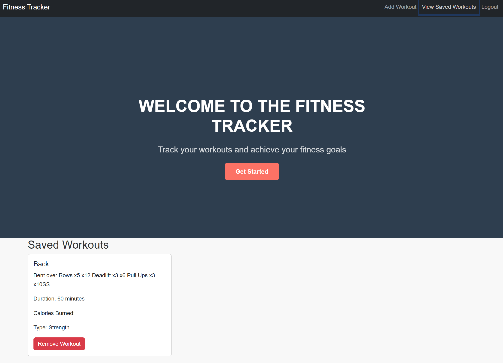

# Full-Stack Developer Bootcamp Project03: Fitness Tracker

## Table of Contents

- [Description](#description)
- [Features](#features)
- [Installation](#installation)
- [Directory Structure](#directory-structure)
- [Usage](#usage)
- [Credit and Source Code](#credits-and-code-source)
- [Contribution](#contribution)
- [Project Team](#project-team)
- [License](#license)
- [Badges](#badges)
- [Tests](#tests)
- [GitHub Repository Location (HTTPS)](#github-repository-location-https)
- [Render App Deployment](#render-app-deployment)
- [Application Screenshots](#application-screenshots) 

## Description

The **Fitness Tracker** is a MERN-stack application on one page that allows users to log in with JWT authentication, creating secure access to saved fitness sessions stored in MongoDB. As developed, the app is accessible through a public web deployment (e.g., Render) or locally via VS Code.

Publicly deployed sessions/entries are held within a Mongo NoSQL database and made accessible through the Web if publicly deployed.

The **Fitness Tracker** source code is published on GitHub and may be cloned to the local computers to run local versions.


## Features

- **Add workout:** Users can log their workouts.

- **View past workouts:** Users are able to look up and view prior workouts.

- **Manage workouts:** Users are able to delete previously saved workouts they no longer wish to keep. 


## Installation

- The **Fitness Tracker** source code may be downloaded from its GitHub repository and run directly by a hosting computer: 

  ```sh
   git clone https://github.com/stephenw987/Fitness-Tracker.git
   ```
  or through a Web hosting service (e.g., Render, Heroku).

- Navigate to the application directory:
  ```sh
   cd Fitness-Tracker
   ```
- Install the dependencies for both the client and server:
   ```sh
   npm run install
   ```

The **Fitness Tracker** requires render and building of client and server aspects. It would then be accessible by the designated port located in `./server/server.js`

## Directory Structure

The directory structure of the application is as follows:
```
Fitness-Tracker/
├── assets/                            // Contains screenshots and application presentation documentations.
├── client/                              
│       ├── public                     // Directory for static assets.
│       ├── src                        // Contains application source code.
│       ├── .eslintrc.cjs              // A configuration file which acts as a static code analysis tool to identify and fix problems in JavaScript code.
│       ├── index.html                 // Main entry point for application website.
│       └── package.json               // Application client configuration file.
│
├── server/                                
│   ├──config/                          // Contains configuration file for the server environment.
│   ├──models/                          // Defines the application data structure.
│   ├──schema/                          // Defines how data is organized, validated, and related within the database.
│   └──utils                            // Contains utlity functions that assist in the application's operation. 
│                         
├── package.json                        // Application configuration file.
└── README.md                           // Application documentation.
```

### Server Configuration

To change server configuration, the user should set the appropriate environment variable:

* The default port for the server is 2001. To change this, set the port `PORT`environment variable to a valid port number.

* The default location of the mongodb database is set to `mongodb://127.0.0.1:27017/fitnessTracker`. To change this, set the `MONGODB_URI` environment variable to a valid mongodb database server. 

* By default the server runs in development mode. To change this, set `NODE_ENV="production"`

### Client Configuration

To change client configuration, the user should edit `client/vite.config.js`:

* The `server.proxy['/graphql'].target` should be set to the correct server uri. The default uri value is `http://localhost:2001`. 

* The `server.port` should be set to the desired port for the react client. The default port is `2000`.

## Usage

**Fitness Tracker** is intended for one or more users to record their fitness sessions/entries. This data will be held locally and will persist across multiple sessions. Users of **Fitness Tracker** on a remote instance can only access their individual entries.


## Credits and Code Source

**Logo icon:** <a href="https://www.flaticon.com/free-icons/sport" title="sport icons">Sport icons created by Flowicon - Flaticon</a>


## Contribution

Here are the guidelines for contributing to this project:

- **Fork the project:** Create a copy of the project.
- **Create a branch:** Create a new branch from the main branch.
- **Make changes:** Improve the project by making commits.
- **Push your changes:** Push your branch to your GitHub project.
- **Open a pull request:** Submit your changes to the upstream repository.
- **Discuss and commit:** The project team may discuss your changes and ask for more commits.
- **Merge or close:** The project team will eventually merge or close your pull request. 
 
Additional tips:

- **Write good bug reports:** Include a summary, background, steps to reproduce, and sample code. 
- **Review documentation:** Before opening a new issue, check the documentation support guide. 
- **Don't duplicate issues:** Search for existing issues to see if yours has already been reported. 
- **Focus on quality:** At the onset, focus only on making minor changes. 


## Project Team

- **Marlon Gonzalez:** [GitHub](https://github.com/arrozDpollo)
- **Emeka Okpala:** [GitHub](https://github.com/Hammarou)
- **Talita Rosa:**  [GitHub](https://github.com/titarosa)
- **Stephen Wei:**  [GitHub](https://github.com/stephenw987)


## License

MIT License

Copyright (c) [2024] [Stephen Wei]

Permission is hereby granted, free of charge, to any person obtaining a copy
of this software and associated documentation files (the "Software"), to deal
in the Software without restriction, including without limitation the rights
to use, copy, modify, merge, publish, distribute, sublicense, and/or sell
copies of the Software, and to permit persons to whom the Software is
furnished to do so, subject to the following conditions:

The above copyright notice and this permission notice shall be included in all
copies or substantial portions of the Software.

THE SOFTWARE IS PROVIDED "AS IS", WITHOUT WARRANTY OF ANY KIND, EXPRESS OR
IMPLIED, INCLUDING BUT NOT LIMITED TO THE WARRANTIES OF MERCHANTABILITY,
FITNESS FOR A PARTICULAR PURPOSE AND NONINFRINGEMENT. IN NO EVENT SHALL THE
AUTHORS OR COPYRIGHT HOLDERS BE LIABLE FOR ANY CLAIM, DAMAGES OR OTHER
LIABILITY, WHETHER IN AN ACTION OF CONTRACT, TORT OR OTHERWISE, ARISING FROM,
OUT OF OR IN CONNECTION WITH THE SOFTWARE OR THE USE OR OTHER DEALINGS IN THE
SOFTWARE.


## Badges

[](https://opensource.org/licenses/MIT)


## Tests

N / A.

## GitHub Repository Location (HTTPS)

https://github.com/stephenw987/Fitness-Tracker.git

## Render App Deployment

https://fitness-tracker-yx3g.onrender.com 


## Application Screenshots





