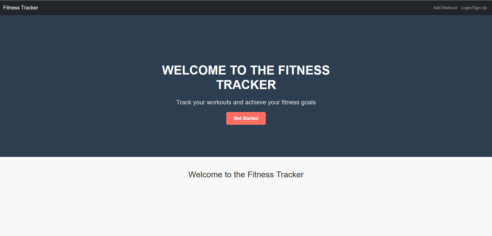
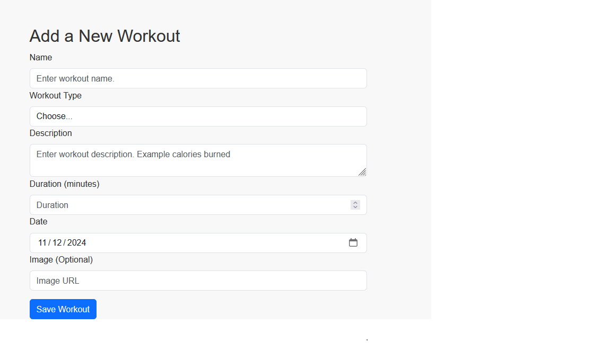

# Full-Stack Developer Bootcamp Project03: Fitness Tracker

## Table of Contents

- [Description](#description)
- [Install](#install)
- [Usage](#usage)
- [Generator](#generator)
- [Badge](#badge)
- [Credit and Source Code](#credits-and-code-source)
- [Related Efforts](#related-efforts)
- [Maintainers](#maintainers)
- [Contributing](#contributing)
- [License](#license)
- [Tests](#tests)
- [GitHub Repository Location (HTTPS)](#github-repository-location-https)
- [GitHub Pages Location](#github-pages-location)
- [Application Screenshots](#application-screenshots) 

## Description

The Fitness Tracker is a MERN-stack application on one page that allows Users to log in with JWT authentication, creating a secure access to saved fitness sessions stored in MongoDB. As developed, the app is accessible through a public web deployment (e.g., Render) or locally via VS Code.

Publicly deployed, sessions/entries are held within a Mongo NoSQL database and made accessible through the Web, if publicly deployed.

The Fitness Tracker source code is published on GitHub, and may be cloned to the local computers to run local versions.

## Installation

The Fitness Tracker source code may be downloaded from its GitHub repository, and run directly by a hosting computer, or through a Web hosting service (e.g., Render, Heroku).

Fitness Tracker requires render and building of client and server aspects. It would then be accessible by designated port located in `./server/server.js`

## Usage

Fitness Tracker is intended for use by one or more Users to record their fitness sessions/entries that will be held remotely and locally, and persist across multiple sessions. 

Users of Fitness Tracker on a remote or local instance will only have access to their individual entries.

<!-- ## Credits and Code Source -->

## License

MIT License

Copyright (c) [2024] [Stephen Wei]

Permission is hereby granted, free of charge, to any person obtaining a copy
of this software and associated documentation files (the "Software"), to deal
in the Software without restriction, including without limitation the rights
to use, copy, modify, merge, publish, distribute, sublicense, and/or sell
copies of the Software, and to permit persons to whom the Software is
furnished to do so, subject to the following conditions:

The above copyright notice and this permission notice shall be included in all
copies or substantial portions of the Software.

THE SOFTWARE IS PROVIDED "AS IS", WITHOUT WARRANTY OF ANY KIND, EXPRESS OR
IMPLIED, INCLUDING BUT NOT LIMITED TO THE WARRANTIES OF MERCHANTABILITY,
FITNESS FOR A PARTICULAR PURPOSE AND NONINFRINGEMENT. IN NO EVENT SHALL THE
AUTHORS OR COPYRIGHT HOLDERS BE LIABLE FOR ANY CLAIM, DAMAGES OR OTHER
LIABILITY, WHETHER IN AN ACTION OF CONTRACT, TORT OR OTHERWISE, ARISING FROM,
OUT OF OR IN CONNECTION WITH THE SOFTWARE OR THE USE OR OTHER DEALINGS IN THE
SOFTWARE.

## Badges

N / A

## Features

N / A

## How to Contribute

N / A

## Tests

N / A

## GitHub Repository Location (HTTPS)

https://github.com/stephenw987/Fitness-Tracker.git

## Render App Deployment

https://fitness-tracker-yx3g.onrender.com 